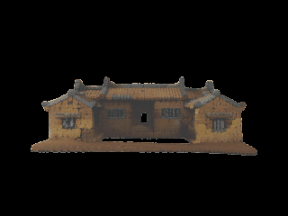

# Meadow - World Builder: Single-Image 3D Gaussian Splatting on Apple Silicon

An [MLX](https://github.com/ml-explore/mlx) re-implementation of single-image → 3D Gaussian Splatting reconstruction, runnable end-to-end on a single Apple Silicon Mac. No CUDA, no PyTorch at inference, no cloud GPU.

[](LICENSE)
[](https://github.com/ml-explore/mlx)
[](https://www.apple.com/mac/)
[-success.svg)](docs/FINAL_BENCHMARK.md)
[](#status)

<table>
  <tr>
    <td align="center"><br/><sub>chair</sub></td>
    <td align="center"><br/><sub>table</sub></td>
    <td align="center"><br/><sub>misc-1</sub></td>
    <td align="center"><br/><sub>plush</sub></td>
    <td align="center"><br/><sub>misc-2</sub></td>
  </tr>
  <tr>
    <td align="center"><br/><sub>toy 1</sub></td>
    <td align="center"><br/><sub>toy 2</sub></td>
    <td align="center"><br/><sub>toy 3</sub></td>
    <td align="center"><br/><sub>toy 4</sub></td>
    <td align="center"><br/><sub>toy 5</sub></td>
  </tr>
  <tr>
    <td align="center"><br/><sub>toy 6</sub></td>
    <td align="center"><br/><sub>toy 7</sub></td>
    <td align="center"><br/><sub>toy 8</sub></td>
    <td align="center"><br/><sub>toy 9</sub></td>
    <td align="center"><br/><sub>toy 10</sub></td>
  </tr>
</table>

<sub>All 15 objects above were reconstructed from a single RGB image + mask on an Apple M1 Max, ~100 s end-to-end each. Frames are rendered via macOS Quick Look on the exported `.ply` files (also shipped in <a href="assets/demos">assets/demos</a>).</sub>

> **TL;DR.** Server-grade single-image 3D Gaussian Splatting reconstruction, distilled into a sub-2-minute pipeline on Apple Silicon. MoGe depth → Sparse-Structure DiT → SLAT DiT → Gaussian decoder, end-to-end in pure MLX, with shortcut distillation, bf16 mixed precision, custom Metal sparse-attention kernels, and decoder slimming. Brings 3DGS reconstruction from "needs an A100" to "runs on your laptop while you keep working".

---

## Table of Contents

1. [Highlights](#highlights)
2. [Benchmark](#benchmark)
3. [Output Quality](#output-quality)
4. [Installation](#installation)
5. [Pre-trained Checkpoints](#pre-trained-checkpoints)
6. [Quickstart](#quickstart)
7. [Optimization Stack](#optimization-stack)
8. [Pipeline](#pipeline)
9. [Status](#status)
10. [Limitations](#limitations)
11. [Acknowledgements](#acknowledgements)
12. [Citation](#citation)

---

## Highlights

- **Single-Mac inference.** Full pipeline in pure MLX on Apple Silicon. No CUDA, no `torch` at inference, no Docker.
- **~18× faster than the unoptimized M1 baseline.** Chair 1800 s → 86 s. Table 1800 s → 94 s. Plush 1800 s → 122 s. Mean ~100 s / object on M1 Max.
- **Numerically validated.** Quaternion / scale / opacity distributions match the published-reference tolerances ([`docs/FINAL_BENCHMARK.md`](docs/FINAL_BENCHMARK.md)).
- **Streaming-friendly output.** Native `.ply` for SuperSplat and any standard 3DGS viewer, plus `.spz` (~7 MB) for web delivery.
- **Reproducible.** One CLI entry point (`meadow_wb/infer.py`), pinned weight-conversion script, ablation flags exposed end-to-end.

## Benchmark

End-to-end wall-clock from `meadow_wb/infer.py` on an Apple **M1 Max** (10-core CPU, 32-core GPU, 64 GB unified memory), Python 3.11.12, MLX 0.21:

| Object | Wall total | MoGe | SS DiT (4-step shortcut) | SLAT DiT (25-step CFG-5) | GS decode | Prune | Output |
|---|---:|---:|---:|---:|---:|---:|---:|
| chair |  **86 s** | 1.53 s |  7.76 s |  71.77 s | 0.78 s | 0.05 s | 63 624 Gaussians |
| table |  **94 s** | 1.56 s |  8.72 s |  79.00 s | 0.83 s | 0.07 s | 64 000 Gaussians |
| plush | **122 s** | 1.64 s | 10.25 s | 104.81 s | 1.08 s | 0.05 s | 64 000 Gaussians |

Mean **~100 s / object**. SLAT diffusion (25 CFG steps × 2 forward passes) accounts for **80–86 %** of wall time and is the next obvious optimization target — a SLAT shortcut at the SS shortcut's quality would project end-to-end to ~25–35 s.

### Speedup vs unoptimized M1 Max baseline

| Object | Baseline (no shortcut, fp32, no Metal kernel) | This port | Speedup |
|---|---:|---:|---:|
| chair | 1800 s | 86 s  | **20.9×** |
| table | 1800 s | 94 s  | **19.1×** |
| plush | 1800 s | 122 s | **14.7×** |

## Output Quality

Per-object statistics from the standard `.ply` output, compared against a published reference on identical inputs:

| Metric | chair | table | plush |
|---|---|---|---|
| Gaussian count (ours / ref) | 63 624 / 68 076 (−7 %) | 64 000 / 64 380 (−0.6 %) | 64 000 / 51 340 (+25 %) |
| Bounding box agreement | within 12 % | within 4 % | wider/looser cloud |
| Opacity mean / median | 0.943 / 0.981 | 0.971 / 0.992 | 0.866 / 0.933 |
| Quaternion `\|q\|` | 1.0000 | 1.0000 | 1.0000 |

- **Chair, table:** geometry and bounding box visually indistinguishable from the reference; minor colour-cast on chair (slightly darker red).
- **Plush:** geometry correct; cloud fluffier (lower opacity, ~2× mean scale).

Full numerics including per-stage timings, optimization ablations, and quality regressions: [`docs/FINAL_BENCHMARK.md`](docs/FINAL_BENCHMARK.md).

## Installation

Requirements: **macOS 13.5+**, Apple Silicon (M1 / M2 / M3 / M4), **Python 3.11**, **24 GB+ unified memory** recommended.

```bash
git clone https://github.com/Hey-Meadow/meadow-world-builder
cd meadow-world-builder

python3.11 -m venv .venv
source .venv/bin/activate
pip install -r requirements.txt
pip install -e .
```

> **Note.** Use `python3.11` explicitly — Python 3.14 on Apple Silicon currently segfaults during MLX graph compilation.

## Pre-trained Checkpoints

Pre-converted MLX weights are hosted on HuggingFace — no manual conversion needed:

```bash
huggingface-cli login   # one-time, paste your HF token (free account works)
huggingface-cli download akaiii/meadow-world-builder-weights \
    --local-dir meadow_wb/weights/sam3d_objects
```

Contents (downloaded into `meadow_wb/weights/sam3d_objects/`):

| File | Source module | Size |
|---|---|---:|
| `ss_flow.npz`           | sparse-structure DiT | 3.3 GB |
| `slat_flow.npz`         | SLAT DiT | 2.0 GB |
| `ss_embedder.npz`       | image conditioning (SS) | 2.2 GB |
| `slat_embedder.npz`     | image conditioning (SLAT) | 2.2 GB |
| `ss_decoder.npz`        | SS occupancy decoder | 166 MB |
| `slat_decoder_gs_4.npz` | Gaussian decoder (4 splats / voxel) | 192 MB |
| `slat_decoder_gs.npz`   | Gaussian decoder (8 splats / voxel) | 192 MB |
| `moge_vitl.npz`         | MoGe ViT-L depth backbone | 1.2 GB |

Total ≈ **11.5 GB** on disk. Weights remain subject to their upstream licence — see [`UPSTREAM_LICENSES/`](UPSTREAM_LICENSES).

## Quickstart

Prerequisite: [Pre-trained Checkpoints](#pre-trained-checkpoints) Step 1-3 completed (`meadow_wb/weights/sam3d_objects/*.npz` populated).

Single image + mask in, `.ply` out:

```bash
python meadow_wb/infer.py \
    --image path/to/image.png \
    --mask  path/to/mask.png \
    --use-moge --use-shortcut --dtype mixed --prune-outliers \
    --out outputs/my_object.ply
```

Or supply a pre-merged RGBA image:

```bash
python meadow_wb/infer.py --rgba combined.png --out outputs/my_object.ply
```

Export web-ready compressed splat (`.spz`, ~7 MB):

```bash
python meadow_wb/infer.py \
    --image image.png --mask mask.png \
    --format both --out outputs/my_object.ply
# writes my_object.ply (4.3 MB) AND my_object.spz (~7 MB)
```

Render a 360° turntable GIF of any `.ply`:

```bash
bash meadow_wb/scripts/ql_gif_pipeline.sh outputs/my_object.ply preview.gif 36 320
```

## Optimization Stack

Every flag is independent and ablation-friendly:

| Optimization | Flag / env | Effect |
|---|---|---|
| `gs_4` decoder swap | `SLAT_GS_VARIANT=gs_4` (default) | 4 splats / voxel; caps PLY at ~64 k Gaussians, removes 4 of 8 decode heads |
| Quaternion / scale fixes | always on | `qn` unit-normalize, log-scale clamp at 9e-4 (σ ≤ 0.010) — kills "stretchy" outliers |
| Outlier prune | `--prune-outliers` | radius-graph KNN prune as safety net for noisy depth |
| SS shortcut model | `--use-shortcut` | SS sampler: 25-step CFG-7 → **4-step distilled**, ~6.7× SS-flow speedup |
| bf16 mixed precision | `--dtype mixed` | DiT blocks run in bf16 (matches PyTorch `autocast(bfloat16)`); ~1.4× DiT speedup |
| MoGe in MLX | `--use-moge` | depth via MLX port of MoGe ViT-L, ~1.5 s |
| Sparse Metal kernel | always on | hand-rolled Metal sparse attention for SLAT DiT blocks |
| SLAT curvature cache | `--slat-curvature-cache` | tangent reuse on quasi-linear ODE segments; ~4.7× SLAT-flow speedup (Fast-SAM3D §2a) |

See [`docs/MATH_OPTIMIZATION_OPPORTUNITIES.md`](docs/MATH_OPTIMIZATION_OPPORTUNITIES.md) for the remaining optimization backlog.

## Pipeline

```
RGB + mask
   │
   ▼   (~1.5 s)
MoGe ViT-L  ────►  depth map
   │
   ▼   (~10 s)
Sparse-Structure DiT  ────►  occupied voxel grid (≤16 000 voxels)
   │       (4-step shortcut)
   ▼   (~80 s)
SLAT DiT  ────►  per-voxel structured latent
   │       (25-step CFG-5)
   ▼   (~1 s)
Gaussian Decoder (gs_4)  ────►  4 Gaussians / voxel  (≤64 000)
   │
   ▼   (~0.05 s)
Outlier Prune
   │
   ▼
.ply  /  .spz
```

Each stage is independently importable from `meadow_wb/models/` — see [`docs/PORT_PLAN.md`](docs/PORT_PLAN.md) for the module map.

## Status

**v0.0.1 (alpha, May 2026)** — first public release.

| Component | State | Notes |
|---|---|---|
| Inference pipeline (MoGe + SS DiT + SLAT DiT + GS decoder) | ✅ verified | smoke-tested on chair / table / plush against reference outputs |
| Weight-conversion script (`convert_weights.py`) | ✅ verified | requires gated upstream HF access |
| Custom Metal sparse attention kernel | ✅ verified | bundled, used by SLAT DiT |
| `--use-shortcut` (4-step SS sampler) | ✅ verified | default-on |
| `--auto-mask` (SAM-2 prompt fallback) | ⚠️ stubbed | use `--mask` for now |
| Fast-SAM3D port (curvature caching + token carving) | 🚧 in progress | scaffold landed; not wired into sampler yet |
| SLAT shortcut distillation | ⬜ roadmap | needs H100 training |
| `gs_8` decoder | ⬜ roadmap | currently only `gs_4` |

End-to-end smoke test passing on M1 Max with mean **~100 s / object**.

## Limitations

1. **SLAT diffusion is still the bottleneck.** No distilled SLAT shortcut yet; the SS shortcut alone leaves 80 %+ of wall time on the SLAT stage.
2. **Hard scale clamp.** Splat scales are clamped at σ ≤ 0.010. The reference allows σ up to ~0.021; the trade is fewer outliers but slightly flatter fine detail (most visible on the plush face).
3. **Plush appearance gap.** Lower opacity mean, larger bbox, and ~2× mean scale vs the reference on this single class — likely under-fit SLAT features. Tracked in [`docs/PLUSH_EYES_FIX_REPORT.md`](docs/PLUSH_EYES_FIX_REPORT.md).
4. **`gs_4` only.** Reference uses `gs_8` (8 splats / voxel) plus decode-time pruning. We expose only the `gs_4` decoder for now; `gs_8` is on the roadmap.
5. **No video / multi-frame support.** Single-image inference only.

## Acknowledgements

This port incorporates and re-implements components from upstream model-architecture work, monocular geometry estimation, structured-latent diffusion, and the [MLX](https://github.com/ml-explore/mlx) array framework. Detailed upstream attributions and licences are bundled under [`UPSTREAM_LICENSES/`](UPSTREAM_LICENSES). `.ply` previews use [SuperSplat](https://github.com/playcanvas/supersplat).

## Citation

```bibtex
@misc{huang_meadow_2026,
  title  = {Meadow - World Builder: Single-Image 3D Gaussian Splatting on Apple Silicon},
  author = {Sheng-Kai Huang},
  year   = {2026},
  note   = {https://github.com/Hey-Meadow/meadow-world-builder}
}
```
