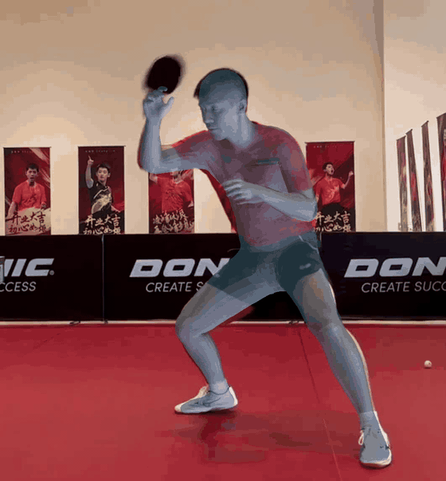
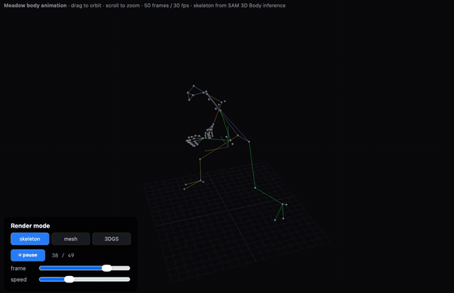
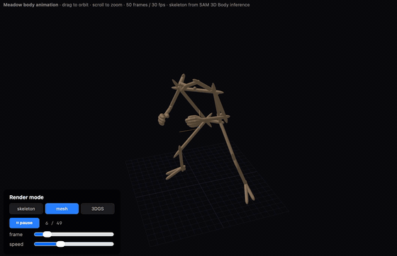
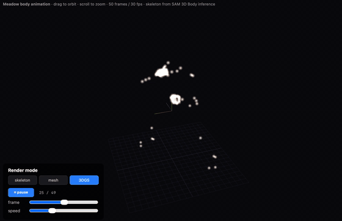

# Motion Capture for Robot Training — Meadow World Builder

A single-RGB-video → 3D skeleton + body mesh + Gaussian-splat motion pipeline, designed to feed humanoid-robot action-training datasets without specialised motion-capture gear.

## Why

Robot policy training (RL, imitation learning, BC, diffusion policies) is bottlenecked by **motion data**. Studios pay for Vicon / Xsens / OptiTrack mocap suits to capture human references. We can replace that with a phone camera plus this pipeline:

| Pipeline stage | Input | Output |
|---|---|---|
| 1. Record | Phone video, any lighting, any clothing | `.mp4` |
| 2. SAM 3D Body inference | `.mp4` frame-by-frame | 70-joint 3D skeleton + SMPL-X-style mesh parameters per frame |
| 3. Export | per-frame `.json` + `joints.npz` | structured time-series of joint positions |
| 4. Visualise / debug | this WebGL viewer | inspect skeleton / mesh / 3DGS in a browser before piping to robot trainer |
| 5. Retarget (out of scope here) | 70-joint skeleton + robot URDF | robot joint trajectory `.bvh` / `.csv` / `.bag` |

Steps 1-4 are demonstrated here. Step 5 is the customer-specific glue — every humanoid platform (Unitree H1, Boston Dynamics Atlas, Tesla Optimus, etc.) has its own DoF count and joint axes, so retargeting code lives downstream of this dataset.

## Demo (4-second clip from a 30 fps phone video)

| Pipeline frame | What it shows |
|---|---|
| **1. Source — SAM 3D Body mesh overlay on input video**<br/> | Mesh + skeleton overlaid on the original phone footage. This is the raw output of SAM 3D Body inference — confirms the model fits the actor. |
| **2. Skeleton view** (this repo's WebGL viewer)<br/> | 70 keypoints + 65 coloured bone lines (mhr70 metadata). The cleanest representation for robot retargeting — joint positions in 3D space, frame by frame. |
| **3. Mesh view** (this repo's viewer)<br/> | Capsule body envelope around the skeleton. Useful for self-collision testing on the humanoid target. |
| **4. 3DGS view** (this repo's viewer)<br/> | Gaussian-splat-style soft point cloud at joints. Renders smoothly with additive blending — useful for stylised previews and PR. |

Open the live viewer at `web/body/index.html` (serve from repo root via `python3 -m http.server 8000` then visit `http://localhost:8000/web/body/index.html`).

## What's in this branch

| Path | What it is | Size |
|---|---|---|
| `assets/motion_capture/*.gif` | 4 demo GIFs (source + 3 modes) | 2.3 MB |
| `web/body/index.html` | Three.js viewer with mode switch + play / scrub / speed | 14 KB |
| `web/body/animation.json` | Joint positions per frame + bone topology + colours, ready for the viewer | 213 KB |
| `web/body/source_data/joints.npz` | Raw SAM 3D Body output: 50 × 70 × 3 keypoints + 50 × 127 × 3 fine joints + fps | 100 KB |
| `web/body/source_data/frames/*.json` | Per-frame SMPL-X parameters: body / hand / face / shape / scale, total 50 frames | 1.3 MB |

## Data spec — `joints.npz`

```
keypoints_3d : float32 (50, 70, 3)   # 70-keypoint canonical skeleton (mhr70 metadata)
joints       : float32 (50, 127, 3)  # 127-joint detailed skeleton (includes hands + face)
fps          : float64 (1,)          # 30.5 (source recording fps)
```

Coordinate frame: SAM 3D Body's native (Y-down, scaled metres). The viewer's `animation.json` re-normalises to a unit cube with Y up and X mirrored (Three.js handedness).

## Data spec — `frames/<NNNN>.json`

Per-frame SAM 3D Body model output:

```
bbox                : (4,)    # 2D bbox of person in image
focal_length        : float   # camera focal length used by the projector
pred_keypoints_3d   : (70,3)  # same as joints.npz row N
pred_keypoints_2d   : (70,2)  # 2D projection
pred_cam_t          : (3,)    # camera translation
body_pose_params    : (133,)  # SMPL-X-style body pose parameters
hand_pose_params    : (108,)  # SMPL-X hand pose parameters
scale_params        : (28,)   # body proportion / scale corrections
shape_params        : (45,)   # body identity / shape (beta-like)
expr_params         : (72,)   # facial expression
pred_joint_coords   : (127,3) # fine joints
```

Reconstructing a textured mesh from these params requires the SAM 3D Body MHR (Mesh Human Representation) decoder + its trained weights, which are upstream-licensed (not redistributed here). See `https://github.com/facebookresearch/sam-3d-body` for the upstream pipeline.

## Robot-retargeting starter checklist

When you wire this into a humanoid trainer:

1. **Pick the joint subset** that matches your robot's DoF count. Typical humanoids use ~25 of the 70 keypoints (hip / knee / ankle / shoulder / elbow / wrist / spine / neck / head).
2. **Solve IK frame-by-frame** from `pred_keypoints_3d` → robot joint angles. Common tools: PyBullet IK solver, MuJoCo `mj_jac`, or a learned IK net like [PHC](https://github.com/ZhengyiLuo/PHC).
3. **Smooth** the resulting joint trajectory (Savitzky-Golay or B-spline) — single-image-per-frame predictions are noisy.
4. **Re-scale to the robot's skeleton lengths** — bone-length-aware retargeting (not just joint angle copy) avoids self-intersection.
5. **Replay in sim** (MuJoCo / Isaac Lab / PyBullet) for physical realism check before training the policy.

## Where Meadow World Builder fits in the larger product

Meadow World Builder's core competence is **single-image / single-video → structured 3D output, on-device, in seconds, on Apple Silicon**. The motion-capture-for-robotics workflow is one application:

- Same hardware path that produces a 3DGS object in ~30 s also produces a 50-frame body skeleton in ~10 s
- No cloud GPU required — the actor's footage never leaves the device, important for IP-sensitive choreography or proprietary stunts
- Output is structured numeric data (`.npz` / `.json`), not opaque binary — directly consumable by any downstream robot trainer

For other applications (3DGS object reconstruction, AR/VR asset production, on-the-fly scene scanning), see the project root `README.md`.

## License

This branch reuses Meadow World Builder's licence — see `LICENSE` at the repo root. The bundled demo data (joints, per-frame JSON, GIFs) was produced from a self-recorded sample video; redistribute the workflow freely, but actor likeness in the source video belongs to the recorder, not this repository.
