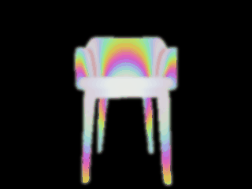
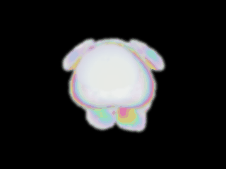

# Iridescent shader animation on 3DGS — prototype report

Branch: `feature/iridescent-shader`
Scripts: `meadow_wb/scripts/apply_iridescent.py`, `meadow_wb/scripts/render_iridescent_gif.py`
Reference look: liquid-metal / thin-film chrome animation (silver base with rainbow bands on highlight regions)

## What works

Per-Gaussian colour overwrite, offline. We read the input `.ply`, compute a synthetic view-dependent rainbow + chrome colour per Gaussian, write the result back into the `f_dc_0..2` SH-DC fields, and stitch a 36-frame turntable with phase-sweep animation.

| Step | Detail |
|---|---|
| 1. Pseudo-normal | radial: each Gaussian's normal ≈ `normalize(xyz − object_centre)` |
| 2. Hue band | `hue = (n·v · freq + phase) mod 1`, sin-ramp to RGB |
| 3. Chrome blend | `n·v`-driven Fresnel + edge-bands (~0.55 and ~0.05 rings) over a `(0.78, 0.80, 0.86)` silver base + cos⁸ spec highlight |
| 4. Animation | sweep `phase` from 0→1 across N frames + Y-rotation by 2π·i/N |
| 5. Soft look | render at 1.5× target size → Gaussian blur (radius 2.5) → Lanczos downscale; kills splat half-tone aliasing without ghosting motion |

Output is a standard `.ply` for every frame — viewable in SuperSplat directly.

### Sample (chair + Oatchi, 36 frames each, chrome preset)

## Honest limitations

1. **Not real-time.** Every frame is a full PLY rewrite + Quick Look render. 36 frames ≈ 90 s on M1 Max. For real-time view-dependent iridescence we need a custom WebGL/Metal splat shader (see "Path to live shader" below).
2. **Pseudo-normal is wrong.** Radial direction from object centre is a passable proxy for *compact convex* objects (chair, Oatchi). For thin or branching shapes (pikmin leaf, mushroom stem) it produces blotchy bands that don't follow real surface curvature. The proper fix is eigendecomposition of each Gaussian's covariance to get the true principal axis — but our SLAT-POLISH scale clamp at σ = 0.010 makes most Gaussians near-isotropic and that signal is noisy.
3. **Pre-baked phase animation.** The phase sweep is encoded into separate PLYs; opening any single PLY in SuperSplat shows a single frame, not an animation. For a real interactive viewer the shader has to be inside the renderer.
4. **No proper specular / no environment map.** "Chrome" is approximated with a constant base colour and cos⁸ spec. Real chrome would sample a chrome HDRI as reflection.

## Path to a live shader

We've validated the *look* offline. To make it interactive view-dependent, replace `apply_iridescent.py` with a fragment-shader hook in the renderer:

| Step | What to do |
|---|---|
| Pick a viewer | [antimatter15/splat](https://github.com/antimatter15/splat), [gsplat.js](https://github.com/dylanebert/gsplat.js), or PlayCanvas SuperSplat — all are WebGL-based and have splat fragment shaders we can override. |
| Inject per-Gaussian normal | Either bake the principal axis into a per-vertex attribute, or compute it in the vertex shader from `rotation + scale` uniforms. |
| Fragment shader | GLSL port of `apply_iridescent.py` colour stack: `hue → rainbow → blend with chrome base by Fresnel(n·v)`. The time-uniform drives `phase`. |
| Output | Same `.ply` + a WebGL bundle; users get real-time iridescent 3DGS in the browser. |

Order-of-effort: a competent GLSL dev can land this in a day if they already have one of the WebGL viewers building. The colour stack is < 30 lines.

## Files in this branch

- `meadow_wb/scripts/apply_iridescent.py` — single-frame colour rewrite, two normal modes (`radial`, `quat`), three tuning knobs (`freq`, `phase`, `metallic-mix`)
- `meadow_wb/scripts/render_iridescent_gif.py` — wraps rotation + iridescent + blur + Quick Look into a one-shot turntable-GIF generator
- `assets/iridescent_test/chair_chrome_iridescent.gif` — sample (chair)
- `assets/iridescent_test/oatchi_chrome_iridescent.gif` — sample (Oatchi)
