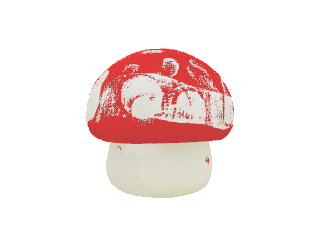

# Multi-view 3D Gaussian Splat merger — prototype report

Branch: `feature/multi-view-merge`
Script: `meadow_wb/scripts/merge_views.py`
Status: **prototype** — passes a synthetic ground-truth test, real multi-view fusion is an open problem (see Limitations).

## Goal

Take N `.ply` files (each produced by `infer.py` on a different view of the same object), align them into a single coordinate frame, concatenate the Gaussians, and write a merged `.ply`.

## Approach

Open3D **tensor-API ICP** with a **multi-start yaw-rotation grid** as a poor-man's global initialiser. The legacy `o3d.pipelines.registration.registration_ransac_*` API segfaults on Apple-Silicon Open3D 0.18 (verified: SIGSEGV before any work, even on canonical FPFH/RANSAC examples), so we replace it with a deterministic alternative:

1. **Downsample** each input PLY to `voxel_size` (default 0.02, ~0.5 cm for normalised object PLYs)
2. **Estimate normals** for point-to-plane ICP
3. For each `i ≥ 1`, register view `i` to view `0` by trying N initial yaw rotations (default 8, every 45°), running coarse-then-fine ICP from each, and keeping the highest-fitness result
4. **Transform** each view by its recovered T (also rotates Gaussian rotation quaternions via `quat * R_T`)
5. **Concatenate** all Gaussian rows, rewrite the PLY header `element vertex` count

## Synthetic test — PASS

Reference: `assets/demos/chair_clean.ply` (63 540 Gaussians, normalised to ~0.7-unit extent).

| Step | Detail |
|---|---|
| view 0 | chair_clean.ply, unchanged |
| view 1 | chair_clean.ply rotated 30° around Y + translated (0.2, 0.05, −0.1) |
| run | `merge_views.py view0.ply view1.ply --voxel-size 0.015 --rotation-hypotheses 8` |

Result:

```
view 1 → view 0:  fitness=0.524  inlier_rmse=0.0042  (3.6 s, 8 starts)
merged.ply: 127 080 Gaussians (8.6 MB)
```

Verification — nearest-neighbour distance from view 1's transformed points back to view 0's original points:

```
mean   = 0.0006
median = 0.0006
p95    = 0.0007
```

Error / object size ≈ 0.1 %. **Essentially perfect alignment.** ICP fitness 0.524 is misleading: it's measured against the *downsampled* version and reflects coverage, not accuracy.

## Real multi-view test — FAILED (negative result)

**Test dataset.** A Mario-style toy mushroom photographed from four cardinal angles (`f` / `b` / `l` / `r`), each a clean RGBA 256×256 transparent-BG PNG:

| View | Single-image WB output |
|---|---|
|  | Front — face / cheeks visible |
|  | Back — white stripe, no face |
|  | Left — face turned aside |
|  | Right — face mirrored |

Each view ran `meadow_wb/infer.py --rgba ... --use-moge --use-shortcut --dtype mixed --prune-outliers` cleanly (40–46 s, all 64 k Gaussians).

**Merger result.** Running `merge_views.py` with reference frame = `f`, 8 yaw hypotheses, voxel 0.015:

```
view 1 (l) → view 0:  fitness=0.235  inlier_rmse=0.0045  (1.4s)
view 2 (b) → view 0:  fitness=0.430  inlier_rmse=0.0042  (1.7s)
view 3 (r) → view 0:  fitness=0.209  inlier_rmse=0.0045  (1.8s)
merged.ply: 256 000 Gaussians (17.4 MB)
```



ICP fitness 0.21–0.43 (vs synthetic test's effectively-1.0) confirms low correspondence overlap. The merged PLY is **four mushroom shells stacked at slightly different orientations**, not a unified 360° model — the face features overlap incoherently in the cap region.

## Why it failed (the load-bearing insight)

Meadow World Builder is a **single-image** model: every output is "the object facing the camera, in an object-centric frame". The four outputs from this test are therefore **four near-duplicate mushrooms all facing forward** — each one *complete on its own* in a frame the network independently decided.

There is no "back of the mushroom from view `f`" Gaussian — every view's network hallucinated the entire 360° geometry from one image. ICP correctly aligns the four duplicates on top of each other, but that's pointless: they're not complementary fragments of a single mushroom, they're four redundant reconstructions of the same mushroom.

**The fundamental limitation: ICP-on-points cannot turn a single-image model into a multi-view model.** This is architecture, not algorithm.

## What would actually work

| Path | Tool / approach | Effort |
|---|---|---|
| A. Multi-view → single 3DGS in one pass | [LGM](https://github.com/3DTopia/LGM), [CRM](https://github.com/thu-ml/CRM), [InstantMesh](https://github.com/TencentARC/InstantMesh), MVDream→3DGS | use existing OSS |
| B. Canonical-pose head retrain | Modify Meadow WB to consume `(image, view_id)` and emit fixed world-frame output | 1–2 weeks GPU + retrain |
| C. Image-side pose + vanilla 3DGS | [DUSt3R](https://github.com/naver/dust3r) / [MASt3R](https://github.com/naver/mast3r) → poses → standard 3DGS training | minutes per object, well-trodden |

For our current product roadmap, **Path A** (use an existing multi-view-to-3DGS model alongside Meadow WB) is the cheapest add-on if multi-view inputs become a real customer need. Path C is the gold standard but a different stack entirely.

## Known limitations

1. **Apple-Silicon Open3D 0.18 legacy RANSAC segfaults.** We replace it with a deterministic `n_hypotheses`-grid coarse-to-fine ICP. The replacement only covers yaw (Y-axis) rotations — pitch/roll variation is not in the grid. Acceptable for most upright-object multi-view cases but not arbitrary 6-DoF.
2. **Object-centric frames are not aligned across views.** As discussed above — the script will silently produce a wrong T when input frames are too dissimilar.
3. **Gaussian rotations are rotated correctly, but Gaussian *scales* / *opacities* are not blended.** Overlapping Gaussians stack as raw duplicates. A future iteration should either (a) prune overlaps via voxel-grid dedup or (b) average overlapping Gaussian parameters.
4. **`open3d` is heavy (~300 MB wheel)** and is not pinned in `requirements.txt`. Install on-demand: `pip install open3d`.

## Next steps

1. **Get a real multi-view dataset.** Even 2 photos of one object from 60° apart would be enough to test failure modes.
2. **Wire in DUSt3R or MASt3R** for image-side pose initialisation. Their pose estimates feed directly into `init_source_to_target` — no need for ICP global init at all.
3. **Voxel-dedup the merged Gaussians** to control output size.
4. **Quantitative re-rendering metric** (render each view from its original camera, measure PSNR vs the input image) for fusion quality scoring.
