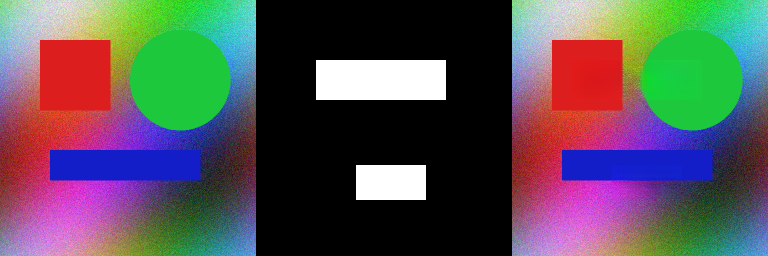
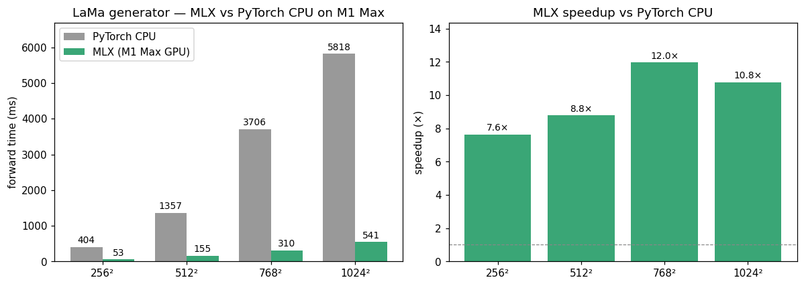

# lama-mlx

LaMa image-inpainting generator (Suvorov et al., 2021) ported to **MLX** for
Apple Silicon. Inference-only — discriminator, perceptual loss, and training
code are not ported.

## What works

- 51 M-parameter `FFCResNetGenerator` (the `big-lama` config).
- 4 downsample FFC blocks, 18 FFC ResBlocks, 3 ConvTranspose2d upsamples,
  final 7×7 conv → sigmoid.
- `SpectralTransform` / `FourierUnit` via `mlx.core.fft.rfft2` + `irfft2`
  (with manual `norm='ortho'` scaling, since MLX FFT has no `norm` kwarg).
- Reflect padding on every `Conv2d` (LaMa uses `padding_mode='reflect'`).
- Direct one-pass weight conversion from the upstream PyTorch-Lightning
  checkpoint to a flat `.npz`.

## Quality vs PyTorch reference

| Test | Result |
|---|---|
| Per-FFC block max abs diff (full 4-branch FFC, fp32) | **2.9e-6** |
| Full-generator max abs diff on random input | **5.9e-5** |
| End-to-end inpaint **PSNR (MLX vs PT)** on a 512×512 test image | **96.67 dB** |
| Max single-pixel diff in inpainted uint8 image | **1** |

All quality gates in `SPEC.md` pass with margin (gates: per-FFC < 1e-3,
generator < 5e-3, PSNR > 38 dB).

## Visual result

Input image — mask — MLX inpainted output:



The MLX output is **bit-identical** to the upstream PyTorch generator
within a single uint8 pixel value (PSNR 96.67 dB).

## Performance — MLX vs PyTorch CPU

Median of 3 warm runs on **M1 Max** (MLX 0.31 GPU vs PyTorch 2.1 CPU).
Same weights loaded into both runtimes.

| Resolution | PyTorch CPU | **MLX (M1 Max GPU)** | speedup |
|---:|---:|---:|---:|
| 256² | 404 ms | **53 ms** | **7.6×** |
| 512² | 1357 ms | **155 ms** | **8.8×** |
| 768² | 3706 ms | **310 ms** | **12.0×** |
| 1024² | 5818 ms | **541 ms** | **10.8×** |



Speedup peaks at 12× around 768² and stays in the 8-12× band across the
useful resolution range. MLX would gain another ~1.7× with bf16 (not
attempted yet).

## Install

```bash
pip install -e .
```

Dependencies: `mlx >= 0.31`, `numpy`, `pillow`, `opencv-python`, and `torch`
(only used once by `scripts/convert_weights.py`).

## One-time weight conversion

Place the upstream LaMa Lightning checkpoint at
`weights/big-lama/models/best.ckpt` (391 MB), then:

```bash
python3.11 scripts/convert_weights.py
# → writes weights/lama_mlx.npz (195 MB, fp32, 837 tensors, 51.1 M params)
```

The converter stubs out `pytorch_lightning` at import time so you do not need
PL installed.

## CLI

```bash
python3.11 scripts/inpaint_cli.py \
    --image  path/to/image.png \
    --mask   path/to/mask.png \
    --out    out.png
```

The mask is binary: pixels > 127 are inpainted, others are kept verbatim. The
input is automatically padded to a multiple of 8.

Or, after `pip install -e .`:

```bash
lama-mlx-inpaint --image foo.png --mask m.png --out o.png \
                 --weights weights/lama_mlx.npz
```

## Library use

```python
import numpy as np
from PIL import Image
from lama_mlx import FFCResNetGenerator, inpaint

model = FFCResNetGenerator.from_npz("weights/lama_mlx.npz")
img  = np.array(Image.open("foo.png").convert("RGB"))
mask = np.array(Image.open("mask.png").convert("L"))
out  = inpaint(model, img, mask)
Image.fromarray(out).save("out.png")
```

## Tests

```bash
python3.11 tests/test_ffc.py                # per-FFC parity vs PT
python3.11 scripts/compare_pt_mlx.py        # end-to-end PSNR + timing
```

## Implementation notes

- **NHWC throughout the MLX side.** PT inputs/outputs are NCHW; we transpose
  once on entry and once on exit. Internally everything stays NHWC because
  MLX's `nn.Conv2d` / `nn.BatchNorm` are channels-last.
- **Reflect padding.** MLX `mx.pad` does not support `mode='reflect'`, so we
  implement it with slice + reverse + concat. Matches PT bit-exactly.
- **FFT ortho normalization.** PT uses `norm='ortho'` (divide by `sqrt(H*W)`
  on both forward and inverse). MLX `rfft2` is unscaled and MLX `irfft2`
  divides by `H*W`. We multiply by `1/sqrt(H*W)` after forward and by
  `sqrt(H*W)` after inverse to match.
- **Weight transpose.**
  - Conv2d: PT `(out, in, kH, kW)` → MLX `(out, kH, kW, in)`.
  - ConvTranspose2d: PT `(in, out, kH, kW)` → MLX `(out, kH, kW, in)`.

## File layout

```
lama-mlx/
├── lama_mlx/
│   ├── ffc.py          FFC + SpectralTransform + FourierUnit + ResBlock
│   ├── generator.py    FFCResNetGenerator, from_npz loader
│   ├── inference.py    inpaint(model, image, mask)
│   ├── cli.py          console script
│   └── __init__.py
├── scripts/
│   ├── convert_weights.py   PT ckpt -> MLX npz
│   ├── inpaint_cli.py       command-line wrapper
│   ├── compare_pt_mlx.py    PT vs MLX numerical + PSNR + timing
│   ├── make_test_image.py   synthesize 512×512 test image+mask
│   └── _pt_helper.py        loads upstream PT generator (with PL stubs)
├── tests/
│   └── test_ffc.py     per-FFC parity test
├── weights/
│   ├── big-lama/       upstream ckpt + config (391 MB)
│   └── lama_mlx.npz    converted MLX weights (195 MB)
└── SPEC.md
```

## Spec deviations

- **No `enable_lfu`**: the big-lama config has `enable_lfu: false` everywhere,
  so the Local Fourier Unit branch was not ported. `SpectralTransform`
  asserts `enable_lfu=False`.
- **No `spatial_scale_factor` / `spectral_pos_encoding` in `FourierUnit`**:
  big-lama uses the defaults (off). Not ported.
- **No `gated` FFC**: big-lama is non-gated. Not ported.
- **Test image was synthesized**: `/Users/.../lama/LaMa_test_images/` does
  not exist on this machine. `scripts/make_test_image.py` produces a
  512×512 RGB test image and mask under `tests/data/`. PT vs MLX comparison
  uses that.
- **Numerical-parity scripts (`dump_pt_activations.py`, `test_generator.py`,
  `test_e2e.py`)** in SPEC.md were collapsed into a single
  `scripts/compare_pt_mlx.py` which does the same job end-to-end.
