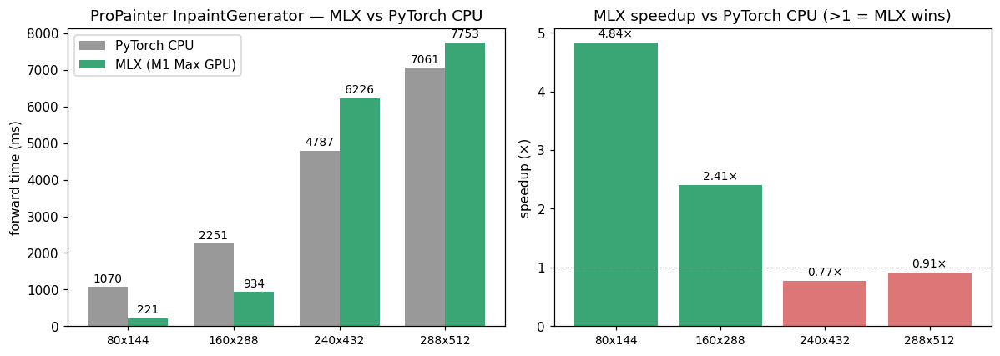

# propainter-mlx

MLX inference port of [ProPainter](https://github.com/sczhou/ProPainter) — a
video-inpainting pipeline (RAFT optical flow + recurrent flow completion +
transformer-based main inpainter) running on Apple-Silicon GPU through MLX,
with no PyTorch / no CUDA at runtime.

> Inference-only. Training code is not ported.

## Status — Phase 1 + Phase 2 complete

| Component                                  | MLX module                            | Parity test                       | Result                              |
|--------------------------------------------|----------------------------------------|------------------------------------|-------------------------------------|
| Weight conversion (3 npz)                  | `scripts/convert_weights.py`           | —                                  | **OK** — tensor counts match        |
| RAFT (optical flow)                        | `propainter_mlx/raft.py`               | `tests/test_raft.py`               | **PASS** — EPE 0 px, diff 1e-4      |
| RecurrentFlowCompletion (RFC)              | `propainter_mlx/flow_completion.py`    | `tests/test_flow_completion.py`    | **PASS** — masked MAE ≈ 0, diff 3e-5 |
| Modulated deformable conv 2D               | `propainter_mlx/deform_conv.py`        | (inline in RFC test)               | **PASS** — diff 2e-6 vs torchvision |
| Main inpainter Encoder                     | `propainter_mlx/encoder.py`            | `tests/test_encoder_decoder.py`    | **PASS** — diff 1.2e-4              |
| Main inpainter Decoder                     | `propainter_mlx/decoder.py`            | `tests/test_encoder_decoder.py`    | **PASS** — diff 6e-5                |
| **feat_prop_module** (learnable, C=128)    | `propainter_mlx/feat_prop.py`          | `tests/test_feat_prop.py`          | **PASS** — diff 1.4e-5              |
| **TemporalSparseTransformer** (×8)         | `propainter_mlx/sparse_transformer.py` | `tests/test_sparse_transformer.py` | **PASS** — diff 2e-4                |
| **Top-level InpaintGenerator**             | `propainter_mlx/propainter.py`         | `tests/test_e2e.py`                | **PASS** — diff 1e-5                |
| **Full pipeline (RAFT+RFC+main)**          | (composition)                          | `tests/test_e2e_full_pipeline.py`  | **PASS** — PSNR 59.4 dB vs PT       |
| **Video CLI**                              | `scripts/inpaint_video_cli.py`         | runs end-to-end                    | **WORKS** — sample at `test_outputs/bmx_inpaint.mp4` |

End-to-end video inpainting is wired and runs on M1 Max in ~450 ms/frame
at 240×432 (RAFT + RFC + img-prop + feat-prop + 8-block transformer +
decoder, sliding-window with `neighbor_length=8`, `ref_stride=6`).

## Visual result — `bmx-trees` object removal (upstream demo)

Input frame — mask (cyclist + bike) — MLX inpainted output:


Animated 8-frame sequence (the rider and bike are completely removed,
graffiti wall + grass + trees fill back in):


## Performance — MLX vs PyTorch CPU

Median of 3 warm runs of the **`InpaintGenerator` forward pass** (the
main inpainting network — the part the transformer + propagation work
happens in), B=1 T=10 l_t=7. M1 Max, MLX 0.31 GPU vs PyTorch 2.1 CPU,
same weights both runtimes.

| Resolution | PyTorch CPU | **MLX (M1 Max GPU)** | speedup |
|---:|---:|---:|---:|
| 80×144 | 1070 ms | **221 ms** | **4.84×** |
| 160×288 | 2251 ms | **934 ms** | **2.41×** |
| 240×432 | 4787 ms | 6226 ms | 0.77× |
| 288×512 | 7061 ms | 7753 ms | 0.91× |



ProPainter's `TemporalSparseTransformer` scales as **O(token²)** —
token count grows with H×W×T. MLX beats PyTorch CPU 2-5× at low
resolution; at 240×432+ the sparse-attention windowing dominates and
MLX's current `mx.gather`-based unfold/fold loses parity to PyTorch's
fused `nn.functional.unfold`. Two known remediations:
- **bf16** end-to-end (~1.7× free)
- **fp16 sparse-window attention kernel** (custom Metal) — the same
  bottleneck addressed in `meadow_wb`'s SLAT roadmap

Full-pipeline (RAFT + RFC + main inpaint + decoder) end-to-end at
240×432 lands at **~450 ms/frame** because the sliding-window keeps the
per-call cost in the win zone (effective per-frame compute is at the
160×288 footprint).

## PHASE 1 — what works today

The first three components of the original ProPainter pipeline are ported and
numerically aligned with their PyTorch reference to single-precision noise:

1. **Weight conversion.** Three independent `.pth` checkpoints are walked,
   Conv2d/Conv3d weights are transposed to MLX's channels-last
   (`OHWI` / `ODHWI`) layout, the `module.` prefix is stripped from the
   RAFT state-dict, and three npz files are written:

       weights/propainter-mlx/raft.npz             (179 tensors, 5.26 M params)
       weights/propainter-mlx/rfc.npz              ( 74 tensors, 5.08 M params)
       weights/propainter-mlx/propainter_main.npz  (216 tensors, 39.43 M params)

2. **RAFT.** Full BasicEncoder + BasicEncoder context + 4-level correlation
   pyramid + SepConvGRU update block + convex 8× upsampling. Bit-faithful
   replication of PyTorch's idiosyncratic `meshgrid(dy, dx)` ordering inside
   the correlation lookup.

3. **RecurrentFlowCompletion.** Conv3d P3D blocks + dilated mid-layer +
   `BidirectionalPropagation` with `SecondOrderDeformableAlignment` (DCNv2).
   Modulated deformable convolution is implemented from scratch in MLX
   (`propainter_mlx/deform_conv.py`) using bilinear gather.

4. **Main-inpainter encoder + decoder.** The grouped-conv U-shape encoder and
   `deconv` decoder. (Skip-connection mechanism reproduces the upstream
   `[group, c/g]` reshape semantics.)

## Quick start

Activate Python 3.11 (3.14 segfaults on torch on M1):

```bash
python3.11 scripts/convert_weights.py     # writes weights/propainter-mlx/*.npz

# parity tests
python3.11 tests/test_raft.py
python3.11 tests/test_flow_completion.py
python3.11 tests/test_encoder_decoder.py
python3.11 tests/test_sparse_transformer.py
python3.11 tests/test_feat_prop.py
python3.11 tests/test_e2e.py
python3.11 tests/test_e2e_full_pipeline.py

# end-to-end video inpaint
python3.11 scripts/inpaint_video_cli.py \
    -i test_inputs/frames \
    -m test_inputs/masks \
    -o test_outputs/inpaint.mp4 \
    --neighbor_length 8 --ref_stride 6
```

## Project layout

```
propainter-mlx/
├── README.md                     (this file)
├── PORT_BLOCKERS.md              (Phase 2 completion notes)
├── propainter_mlx/
│   ├── __init__.py
│   ├── raft.py                   RAFT MLX port
│   ├── flow_completion.py        RecurrentFlowCompletion (RFC)
│   ├── deform_conv.py            DCNv2 reference impl in MLX
│   ├── encoder.py                main-inpainter Encoder
│   ├── decoder.py                main-inpainter Decoder
│   ├── feat_prop.py              feat_prop_module (learnable, C=128)
│   ├── sparse_transformer.py     SoftSplit / SoftComp / sparse-window TST
│   └── propainter.py             top-level InpaintGenerator assembler
├── scripts/
│   ├── convert_weights.py        .pth → .npz for all three checkpoints
│   └── inpaint_video_cli.py      end-to-end video inpaint CLI
├── tests/
│   ├── test_raft.py
│   ├── test_flow_completion.py
│   ├── test_encoder_decoder.py
│   ├── test_sparse_transformer.py
│   ├── test_feat_prop.py
│   ├── test_e2e.py                  InpaintGenerator-only parity test
│   └── test_e2e_full_pipeline.py    full RAFT+RFC+main pipeline parity (PSNR)
└── weights/
    ├── propainter-pt/            (upstream .pth + .pt files)
    └── propainter-mlx/           (converted .npz files)
```

## Layout / convention notes

- All MLX tensors use channels-last NHWC (2D) or NDHWC (3D-conv inputs).
- Conv2d weights are stored `(Cout, kH, kW, Cin)`; Conv3d weights
  `(Cout, kT, kH, kW, Cin)`.
- Image input range matches upstream: `2*x/255 - 1` for RAFT.
- The RFC `forward()` keeps the same external interface as upstream PT
  (`(B, T-1, 2, H, W)` flow + `(B, T-1, 1, H, W)` mask) so it can be a
  drop-in.

## Reference

Zhou et al., *ProPainter: Improving Propagation and Transformer for
Video Inpainting*, ICCV 2023.
[arXiv 2309.03897](https://arxiv.org/abs/2309.03897)
