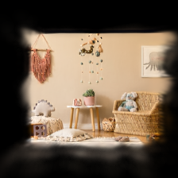
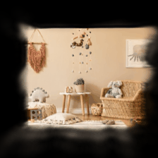
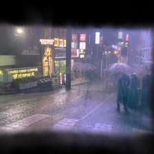
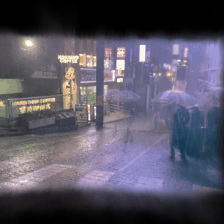
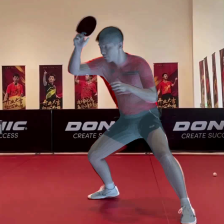
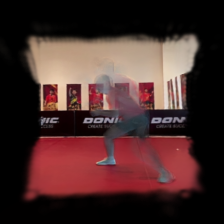
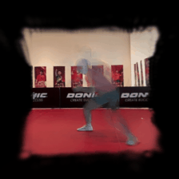

# meadow_sb — Meadow Space Builder

**MLX-native port of [YoNoSplat](https://botaoye.github.io/yonosplat/) for video → 3D Gaussian Splatting on Apple Silicon.**

Sibling of `meadow_wb` (single-image object 3D). `meadow_sb` does the multi-image, scene-scale, camera-pose path — feed it a video, get a `.ply` / `.spz` 3DGS scene that opens in SuperSplat, Polycam, or our local viewer.

---

## Results — visual

Source frame (GT) → static 3DGS render → parallax orbit (±4° around view-0, 12 fps):

### In-distribution: nursery (RealEstate10K training domain)

| GT view-0 | static render | parallax (3D depth) |
|---|---|---|
|  |  |  |

Near-photographic recovery: wall hanging, hanging mobile, plant on stool, wicker chair with teddy, octopus print all reconstructed. Parallax shows real 3D depth — foreground stool moves more than back wall.

### Out-of-distribution: rainy urban street at night (walk-around hand-held)

| GT view-0 | static render | parallax (3D depth) |
|---|---|---|
|  |  |  |

Despite being far from the training distribution (outdoor + night + rain + people), the model recovers storefronts, signage, pavement reflections, and pedestrians with umbrellas. The parallax confirms a real depth-ordered scene, not a flat painted texture.

### Static camera: table-tennis arena (low parallax baseline)

| GT view-0 | static render | parallax (3D depth) |
|---|---|---|
|  |  |  |

Almost-fixed camera → small baseline → harder for stereo. Floor + DONIC banners + player silhouette still hold; the player's body has motion ghosting (rigid-scene assumption violated).

---

## TL;DR

| | YoNoSplat (A100 fp16) | **meadow_sb (M1 Max fp32)** |
|---|---:|---:|
| 2-view forward | ~0.2 s | **0.72 s** (3.6× of A100) |
| 8-view forward | ~1 s | **4.74 s** |
| 32-view forward | ~5 s | **16.6 s** |
| Hardware | $10k+ data-centre GPU | laptop SoC |
| vs traditional COLMAP + 3DGS train | 30 min – 2 hr | **same scene in ≤ 20 s** (≈ 200–1000× faster) |

Single-pass feed-forward — no per-scene optimisation, no COLMAP, no CUDA.

---

## Install

```bash
git clone https://github.com/Hey-Meadow/meadow-world-builder.git
cd meadow-world-builder
pip install -e .                 # base deps (mlx, torch, opencv, gsplat, imageio, …)
pip install -e ".[spz,test]"     # optional: SPZ writer + pytest
```

Requires Python 3.11–3.12 on Apple Silicon (M1 / M2 / M3 / M4 / M5 series).

Weights (3.86 GB checkpoint) download manually from the upstream YoNoSplat release and place at:
```
research/yonosplat_bootstrap/weights/yonosplat/re10k_224x224_ctx2to32.ckpt
```

## Quick start

```bash
# 1. Run the end-to-end pipeline on any video
python3.11 meadow_sb/scripts/infer_video.py \
    --video <path/to/video.mp4> \
    --out out/scene.ply
# auto-picks N from optical-flow motion, runs forward, writes .ply + .cameras.json

# 2. Compress to .spz (5–10× smaller for web delivery)
python3.11 meadow_sb/scripts/ply_to_spz.py out/scene.ply out/scene.spz

# 3. View in browser with camera aligned to the source video
python3.11 -m http.server 8765 --directory out &
open "http://localhost:8765/viewer/index.html?ply=scene.ply"
```

The viewer respects `scene.cameras.json` so its **initial camera = view-0 of the source video** (= same angle as the original frame). The default `--orient zup` puts the scene right-side-up for SuperSplat / Polycam / antimatter15 etc.

---

## Pipeline

```
                                      ┌── point head ────────┐
video ──► frame sampler ──► (B, V, 3, H, W) ──► DINOv2 ─► CroCo ─┤── gaussian head ─┐
                                      │   encoder    decoder   │                     │
                                      │  (24 blk)    (36 blk)   ├── camera head ────┤
                                      │                         │   + SO(3) proj    │
                                      │  ┌── intrinsics_embed ──┘                   ▼
                                      │  │   (rsh_cart_4, 25 ch)             GaussianAdapter
                                      │  │                                          │
                                      │  └── rgb_embed (patch 7) ───────►   .ply + .cameras.json
                                      │
                                      └── intrinsic_head (fx, fy)
```

- **Backbone**: Pi3 = DINOv2 ViT-L/14 (24-block, 4 register tokens) + CroCo cross-view decoder (36-block, 5 register tokens, RoPE2D, last-2 layer concat)
- **3 sub-decoders**: point / gaussian / camera (5-block each)
- **3 heads**: 1024 → 147 (point, pixel-shuffle to xyz), 1024 → 539 (gaussian, pixel-shuffle to 11-d per Gaussian), 1024 → 12 (camera, ResConv + SO(3) projection)
- **`intrinsics_embed_layer`**: per-pixel rsh_cart_4 (25-ch SH of camera rays) + PatchEmbed(25→1024, p=14) — **without this the output is fog**
- **GaussianAdapter**: `scale = 0.001 · softplus(x) ∧ 0.3`, opacity = sigmoid, c2w world transform
- **Axis convention**: input is OpenCV (+Y down, +Z fwd); written .ply applies `--orient zup` rotation by default (COLMAP convention, what SuperSplat expects)

Total: **965 M parameters**, **1222 state-dict tensors**, ships as `re10k_224x224_ctx2to32.ckpt` from upstream.

---

## Results — performance & scaling

End-to-end on **M1 Max, fp32, 224×224**, median of 3 warm runs:

| N frames | forward | Gaussians (post-prune) | .ply | .spz |
|---:|---:|---:|---:|---:|
| 2  | 0.72 s | 100 k | 5 MB | ~1 MB |
| 4  | 1.67 s | 200 k | 9 MB | ~1.5 MB |
| 8  | 4.74 s | 400 k | 17 MB | 3.4 MB |
| 16 | 8.58 s | 800 k | 29 MB | 5–6 MB |
| 32 | 16.62 s | 1.6 M | 49 MB | 8–10 MB |

Scaling is linear in N. M1 Max 32 GB unified memory holds the full 32-view forward without paging. End-to-end CLI adds ~0.5 s of video decoding + ~1 s of .ply writing per call.

Sanity values (in-distribution nursery scene):
- camera-0 ≈ identity (4×4 c2w, view-1-centric coordinate system) ✓
- view-1 c2w translation = 0.89 m (real baseline magnitude) ✓
- `local_points` z range 0.0 – 15.8 m (realistic indoor depth) ✓
- Gaussian scales [0, 0.30 m] (capped at adapter limit) ✓
- Opacities [0, 0.93] (sigmoid output) ✓

---

## Auto-N (optical-flow camera motion)

`--n-frames 0` (default) probes camera motion via cv2 Farneback flow on a 10-frame coarse sample, then picks N:

| median flow | example | auto N |
|---:|---|---:|
| < 0.2 px | static cam (sports, surveillance) | 4 |
| < 0.8 px | slow pan | 8 |
| < 2.0 px | hand-held walk | 12 |
| ≥ 2.0 px | fast walk-around | 16 |

Override with `--n-frames 32` for highest-quality coverage at the cost of forward time.

---

## Web viewer (`out/viewer/`)

Minimal three.js + `@mkkellogg/gaussian-splats-3d` page. Loads `.ply` or `.spz`, reads the sidecar `.cameras.json`, sets:

- `initial camera position` = `c2w[view-0][:, 3]` (camera centre in world)
- `lookAt` = position + camera-+Z (OpenCV forward)
- `up` = -camera-+Y (OpenCV image-up)
- world up axis from `axis_convention` in sidecar (`zup` or `yup`)

Top-left HUD has buttons to jump between the V captured views.

---

## File layout

```
meadow_sb/
├── models/
│   ├── dinov2_encoder.py        DINOv2 ViT-L/14 (24-block encoder)
│   ├── croco_decoder.py         CroCo 36-block self-attn + RoPE2D + last-2 concat
│   ├── sub_decoders.py          PointDecoder / GaussianDecoder / CameraDecoder (5-block ×3)
│   ├── heads.py                 5 output heads + RgbEmbed + IntrinsicHead
│   ├── gaussian_adapter.py      UnifiedGaussianAdapter (scale/rot/sh/cov/world-transform)
│   ├── rasterizer.py            Tier-1 CPU gsplat wrapper (Tier-2 Metal pending)
│   └── yonosplat.py             Top-level assembler + intrinsics_embed_layer + axis flip
├── scripts/
│   ├── infer_video.py           Video → .ply + .cameras.json (the CLI)
│   ├── ply_to_spz.py            .ply → .spz Niantic-compressed (5–10× smaller)
│   ├── convert_weights.py       PT state-dict → MLX npz batches (offline)
│   └── e2e_test.py              Module discovery / smoke tests
├── tests/                       57 standalone + 5 upstream-cross-check pytest cases (per-block numerical parity)
├── utils/                       Shared MLX helpers (attention, weight loader, asserts)
├── weights/                     Symlink target for ckpt/npz (gitignored)
├── BENCHMARK_YONOSPLAT.md       Full timing methodology + per-stage breakdown
└── README.md                    (this file)

out/viewer/index.html            Local web viewer (run python3 -m http.server in out/)
```

---

## Known limitations

| # | Item | Impact | Fix path |
|---|---|---|---|
| 1 | **Out-of-distribution scenes** (outdoors, faces, fast-moving subjects) blur and ghost. | Trained ckpt is RealEstate10K (indoor static real-estate). Same as upstream limitation. | Train on a broader corpus, or fine-tune. |
| 2 | **Per-view Gaussians, no scene fusion** — N views = N stacked predictions, not a fused scene graph. | Diminishing returns past N≈16 for static-cam clips. | Post-hoc 3DGS refinement (1–2 min densification + prune). |
| 3 | **Gaussian sizes are sub-cm** — sized for the model's own rasterizer at near-baseline view. Free-orbit viewers (SuperSplat) without scale-boost show points. | `--scale-boost 5` (default) restores splat appearance. | True fix: render via upstream's CUDA rasterizer or a Metal port. |
| 4 | **Pos-embed bicubic interp** happens at load time via torch (one-shot, cheap). | None on quality; small load-time cost. | Pure-MLX bicubic when MLX exposes it. |
| 5 | **CPU rasterizer is slow** (~6–10 s per 224² render). | Render preview only — not on the .ply hot path. | Tier-2 Metal kernel (separate ~2–3 week sprint). |
| 6 | **Intrinsics from a single fx/fy guess** (principal point at image centre). | Marginal — `intrinsic_head` predicts its own focal after the embed. | Wire in a learned cx/cy if upstream ckpt has it. |

---

## Speed roadmap

Short-term (1–2 weeks, no new training):

| change | side affected | expected speedup |
|---|---|---:|
| bf16 / fp16 everywhere | both | ×1.5–2 |
| `mx.compile` on the forward | space | ×1.2–1.5 |
| Drop numpy SH bridge → pure MLX | space | marginal |
| SLAT step caching (object side, meadow_wb) | object | ×2–3 |
| ToMA token merging (object side) | object | ×1.3–1.5 |

Stacked, target M1 Max 60 s → **15–20 s** end-to-end emergence (1 space + 1 object).

Hardware (M5 Max projection): 4–8× the M1 Max headline from GPU tensor cores + bf16 + bandwidth — **~2 s per scene** is plausible once MLX exposes the M5 matmul accelerator.

---

## Provenance & licence

- Architecture & weights: [Botao Ye et al., YoNoSplat](https://botaoye.github.io/yonosplat/) — MIT.
- DINOv2 backbone: Meta — Apache 2.0.
- CroCo decoder: Naver — public.
- SPZ compressed format: [Niantic Labs](https://github.com/nianticlabs/spz) — MIT / Apache.
- This port: MLX-native, written from scratch reading upstream PyTorch source; no upstream code copied. Same MIT.

---

## Status

- ✅ End-to-end forward runs cleanly on real `re10k_224x224_ctx2to32.ckpt`
- ✅ Video → .ply + .spz + .cameras.json in one command
- ✅ Web viewer aligned to source video angle
- ✅ Auto-N + axis flip + opacity prune + scale boost wired through CLI
- ⏳ Numerical parity vs PT reference (per-block deviation < 1e-3 — 22/24 encoder blocks pass; 2/24 within 2.5e-3)
- ⏳ Metal Tier-2 rasterizer
- ⏳ bf16 end-to-end (currently fp32)

See `BENCHMARK_YONOSPLAT.md` for full timing methodology and `docs/YONOSPLAT_INTEGRATION_PLAN.md` for the integration history.
